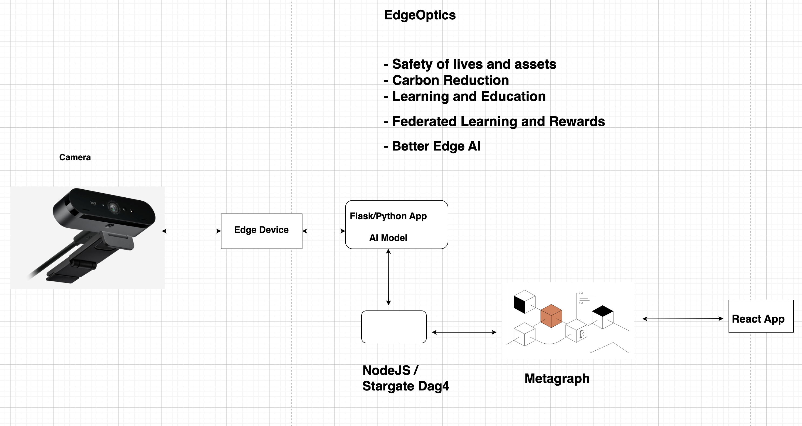
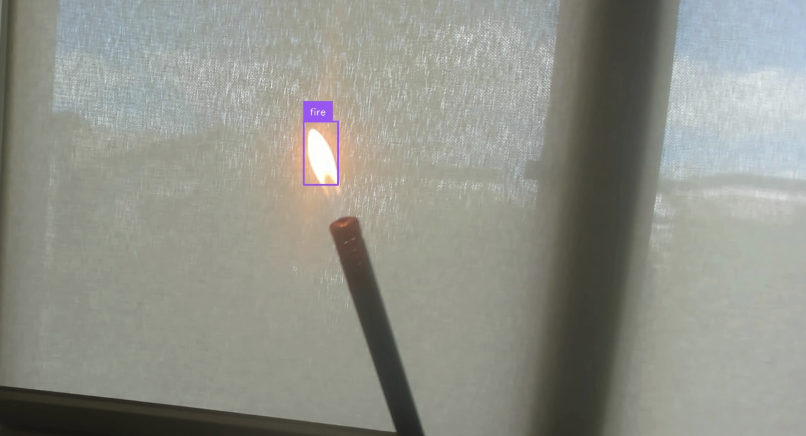

# EdgeOptics - Constellation Metagraph and YOLOv10

## Solution Overview

This project uses YOLOv10, the Constellation Metagraph network and microservice, and other services to detect critical events (e.g. fire), store the events and notify the stakeholders for action.

## Full list of implemented services 
* [backend-stargazer](./backend-stargazer) - NodeJS API, file storage on IPFS via Pinata, and implementation of the utility functions from the dag4 library to write data to the metagraph network. Receives object detection event data from the Flask service
* [edge-optics-flask](./edge-optics-flask) - Flask service containing codes and classes for connecting to the webcam, sending inference result to the NodeJS service, and file storage on S3 bucket from captured camera frames containing critical event.
* [metagraph-example](./metagraph-example) - Metagraph example used for storing data from the NodeJS service
* [frontend](./frontend) - React application for reading the data on the metagraph network

## Full list of documentation - service by service
